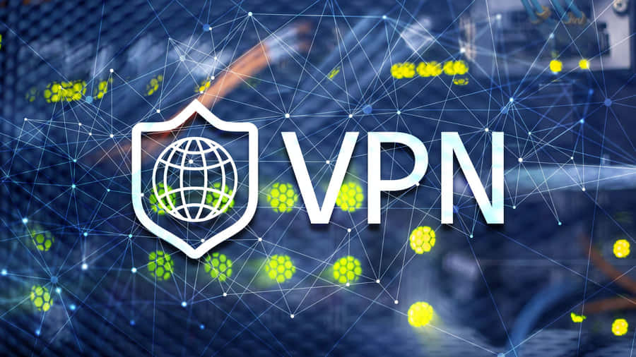

  

<h1 align="center">🔒 MyVPN – Secure & Private Internet Access</h1>

  MyVPN is a lightweight, secure, and easy-to-use VPN service designed to protect your online privacy and give you unrestricted access to the internet.

---

## 🌍 Key Features
- 🔐 **Encryption** – Keep your data safe with strong encryption  
- 🚀 **Fast Servers** – Connect to global servers for high-speed browsing  
- 🌐 **Unblock Websites** – Access geo-restricted content anywhere  
- 📱 **Cross Platform** – Works on Android, Windows, Linux, and more  
- 🛡 **No-Logs Policy** – Your activity is never stored or shared  

---

## 📥 Download MyVPN

  <a href="https://your-link-here.com" style="text-decoration:none;">
    

      ⬇️ Download MyVPN
    

  </a>

---

## ⚡ How to Use
1. **Download and install MyVPN**  
2. **Open the app and sign in**  
3. **Choose a server and connect**  
4. ✅ Enjoy private & secure browsing 🎉  

---

## 📌 License
This project is licensed under the **MIT License** – feel free to modify and share.  
